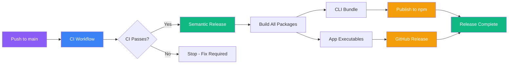

# Contributing to ai-brain-tool

We want to make it easy for you to contribute to ai-brain-tool.

## What We Look For

- Bug fixes
- New features and improvements
- Documentation improvements
- Test improvements

If you're unsure if a PR would be accepted, feel free to ask a maintainer or look for issues with labels like `help wanted`, `good first issue`, or `bug`.

## Monorepo Structure

This is a monorepo with 4 packages managed by Bun workspaces:

```
ai-brain-tool/
├── packages/
│   ├── core/          # Business logic (config, graphify, platforms, etc.)
│   ├── cli/           # CLI tool (@jorge-moreira.dev/ai-brain-tool)
│   ├── app/           # ElectroBun desktop app
│   └── ui/            # React component library (shadcn/ui)
├── README.src.md      # Multilingual README source
├── CONTRIBUTING.md    # This file
└── docs/
    └── DESIGN.md      # Design specification
```

**Dependency graph:** `cli → core`, `app → core + ui`, `ui` (standalone).

## Package-Specific Documentation

Each package has its own documentation:

| Package  | README                            | CONTRIBUTING                                  | AGENTS                            |
| -------- | --------------------------------- | --------------------------------------------- | --------------------------------- |
| **Core** | [README](packages/core/README.md) | [CONTRIBUTING](packages/core/CONTRIBUTING.md) | [AGENTS](packages/core/AGENTS.md) |
| **CLI**  | [README](packages/cli/README.md)  | [CONTRIBUTING](packages/cli/CONTRIBUTING.md)  | [AGENTS](packages/cli/AGENTS.md)  |
| **App**  | [README](packages/app/README.md)  | [CONTRIBUTING](packages/app/CONTRIBUTING.md)  | [AGENTS](packages/app/AGENTS.md)  |
| **UI**   | [README](packages/ui/README.md)   | [CONTRIBUTING](packages/ui/CONTRIBUTING.md)   | [AGENTS](packages/ui/AGENTS.md)   |

**Note:** `AGENTS.md` files contain instructions for AI coding assistants. Use `CONTRIBUTING.md` for human contributor guidelines.

## Developing ai-brain-tool

### Requirements

- Bun 1.0+ (or Node.js 18+)

### Install Dependencies

```bash
# From monorepo root
bun install
```

### Running Commands

```bash
# Format code
bun run format

# Lint code
bun run lint

# Run all tests
bun run test

# Core tests only
bun run test:core

# CLI tests only
bun run test:cli

# App dev server
bun run app:dev

# CLI locally
bun run cli:start
```

### Running Tests

```bash
# All packages
bun run test

# With coverage
bun run test:coverage

# Core package
bun run test:core
bun run test:core:unit
bun run test:core:integration

# CLI package
bun run test:cli
bun run test:cli:unit
bun run test:cli:integration
bun run test:cli:e2e  # Requires Docker

# Single test file
bun vitest run packages/core/tests/unit/config/state.test.ts
bun vitest run packages/cli/tests/unit/commands/setup.test.ts
```

**Coverage requirements:** All PRs must maintain 85%+ code coverage.

### Test Structure

| Category    | Location                        | CI Job        | Runs on                     |
| ----------- | ------------------------------- | ------------- | --------------------------- |
| Unit        | `packages/*/tests/**/*.test.ts` | `unit`        | All PRs + main              |
| Integration | `packages/*/tests/integration/` | `integration` | All PRs + main              |
| E2E         | `packages/cli/tests/e2e/`       | `e2e`         | Main + PRs with `e2e` label |

**To run E2E tests on a PR:** Add the `e2e` label and push a new commit (or manually re-run the workflow).

## Pull Requests

### Issue First Policy

**All PRs must reference an existing issue.** Before opening a PR, open an issue describing the bug or feature. Use `Fixes #123` or `Closes #123` in your PR description to link the issue.

### Commit Messages

This project uses [Conventional Commits](https://www.conventionalcommits.org/). Commit messages must follow this format:

```
<type>(<scope>): <description>
```

**Types:**

- `feat` — new feature or functionality
- `fix` — bug fix
- `docs` — documentation or README changes
- `chore` — maintenance tasks, dependency updates
- `refactor` — code refactoring without changing behavior
- `test` — adding or updating tests
- `style` — code style changes (formatting, semicolons, etc.)

**Scope:** Use the package name or module name (e.g., `core`, `cli`, `app`, `ui`, `config`, `platforms`).

**Examples:**

```
feat(cli): add bun support for faster installs
fix(core): resolve gitSync being ignored in /brain update
docs: update contributing guidelines
chore(ui): update shadcn components
```

### General Requirements

- Keep pull requests small and focused
- Explain the issue and why your change fixes it
- Ensure all tests pass before submitting
- Maintain 85%+ code coverage
- Follow existing code style and patterns
- Run `bun run lint` and `bun run format:check` before committing

### CI Checks

All PRs run the following checks automatically:

1. **Unit tests** - All packages with coverage reporting
2. **Integration tests** - Package integration tests
3. **E2E tests** - Full end-to-end test (only on `main` or PRs with `e2e` label)
4. **Lint** - ESLint check
5. **Format** - Prettier check

**Before pushing:** Run `bun run test:coverage`, `bun run lint`, and `bun run format:check` locally to verify.

## Issue Templates

This project uses GitHub issue templates. When opening an issue, please use the appropriate template:

- **Bug report** — for reporting bugs (requires description and reproduction steps)
- **Feature request** — for suggesting enhancements (requires verification that it hasn't been suggested before)

## Translating the README

`README.md` and the per-language `docs/i18n/README.<lang>.md` files are auto-generated from `README.src.md`. **Don't edit them directly** — the next regeneration overwrites your changes.

To add a new language (example: French / `fr`):

1. Edit `README.src.md`.
2. Add `fr` to `<!--@nrg.languages=en,es-->` near the top → `<!--@nrg.languages=en,es,fr-->`.
3. Add `<!--@nrg.fileNamePattern.fr=docs/i18n/README.fr.md-->` so the output file lands under `docs/i18n/`.
4. For each line tagged `<!--en-->`, add a parallel line with your French translation tagged `<!--fr-->`. Lines without a marker are shared across every language.
5. Open a PR. On merge to `main`, the regenerate job commits the new `docs/i18n/README.fr.md` automatically.

To update an existing translation, edit only the lines tagged with that language inside `README.src.md`. The drift-check job on PRs will fail if a generated file was hand-edited, with a clear diff pointing back at `README.src.md`.

See [`.github/workflows/nrg.yml`](.github/workflows/nrg.yml) for the active workflow and [nanolaba/readme-generator](https://github.com/nanolaba/readme-generator) for the full template syntax reference.

## Release Process

This project uses semantic-release for automated releases. A single version is used for the entire monorepo.

### What Gets Released

| Package | Target | How |
|---------|--------|-----|
| **@jorge-moreira.dev/ai-brain-tool** | npm | Published automatically |
| **@ai-brain/app** | GitHub Releases | Executables for macOS, Windows, Linux |
| **@ai-brain/core** | Internal | Not published |
| **@ai-brain/ui** | Internal | Not published |

### Release Workflow



### Workflow Steps

1. **CI Workflow** - All tests must pass (unit, integration, E2E)
2. **Semantic Release** - Determines next version from commit messages
3. **Build CLI** - Creates `dist/index.js` bundle
4. **Build App** - Builds executables for macOS, Windows, and Linux in parallel
5. **GitHub Release** - Creates release with app executables attached
6. **npm Publish** - Publishes CLI package to npm
7. **Update Templates** - Triggers workflow to update bug report templates

### Secrets Required

The following secrets must be configured in GitHub repository settings:

| Secret | Purpose |
|--------|---------|
| `NPM_TOKEN` | npm publish authentication |
| `APPLE_ID` | macOS app code signing |
| `APPLE_TEAM_ID` | Apple team identifier |
| `APPLE_APP_SPECIFIC_PASSWORD` | Apple app-specific password |
| `CSC_LINK` | Code signing certificate |
| `CSC_KEY_PASSWORD` | Certificate password |

### Manual Release

If the automated release fails:

```bash
# 1. Ensure you're on main with latest changes
git checkout main
git pull

# 2. Run semantic-release locally to determine version
npx semantic-release --dry-run

# 3. Build CLI
bun run --cwd packages/cli build

# 4. Build App
bun run --cwd packages/app build

# 5. Publish CLI manually
cd packages/cli
npm version <version-from-semantic-release>
npm publish

# 6. Create GitHub Release manually
gh release create v<version> --generate-notes
```

### Release Notes

Release notes are auto-generated from commit messages using semantic-release. The changelog includes changes from all packages in the monorepo.
