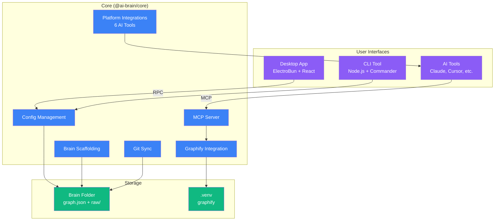
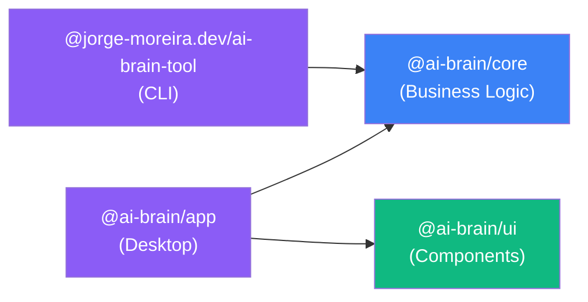

<!-- This file was automatically generated by Nanolaba Readme Generator (NRG) 1.2 -->
<!-- Visit https://github.com/nanolaba/readme-generator for details -->
<div align="center">
  <a href="#"></a>
  
  <h3>Tu memoria de IA personal, conectada a todas tus herramientas de IA</h3>
  <br>

[](https://github.com/jorge-moreira/ai-brain-tool/actions/workflows/ci.yml)
[](https://codecov.io/gh/jorge-moreira/ai-brain-tool)
[](https://www.npmjs.com/package/@jorge-moreira.dev/ai-brain-tool)
[](https://www.npmjs.com/package/@jorge-moreira.dev/ai-brain-tool)
[](https://github.com/jorge-moreira/ai-brain-tool/releases)
[](LICENSE)
[](https://github.com/sponsors/jorge-moreira)

[English](../../README.md) · [Español](README.es.md)

*Desarrollado con* **[graphify](https://github.com/safishamsi/graphify)**

<a href="https://graphifylabs.ai"></a>

> El motor de grafos de conocimiento que convierte carpetas de notas, código, artículos y multimedia en un grafo consultable que tus herramientas de IA pueden recorrer.

[Inicio rápido](#inicio-rápido) · [Arquitectura](#arquitectura) · [Paquetes](#paquetes) · [Contribución](#contribución) · [Licencia](#licencia) · [Créditos](#créditos)

</div>

---

## Inicio rápido

### Opción 1: Aplicación de escritorio (Recomendado)

Descarga para tu plataforma:

| Platform    | Download                                                                         |
| ----------- | -------------------------------------------------------------------------------- |
| **macOS**   | [Download .dmg](https://github.com/jorge-moreira/ai-brain-tool/releases/latest)  |
| **Windows** | [Download .zip](https://github.com/jorge-moreira/ai-brain-tool/releases/latest)  |
| **Linux**   | [Download .tar.gz](https://github.com/jorge-moreira/ai-brain-tool/releases/latest) |

### Opción 2: CLI

```bash
# Install globally
npm install -g @jorge-moreira.dev/ai-brain-tool

# Or use without installing
npx @jorge-moreira.dev/ai-brain-tool setup
```

### Asistente de configuración

Tanto la app como la CLI te guiarán a través de:

1. Creating your brain folder
2. Installing graphify
3. Configuring AI tools (Claude Code, OpenCode, Cursor, Gemini CLI, Copilot CLI, Codex CLI)
4. Optional: Obsidian integration

---

## Arquitectura



### Componentes

| Component       | Purpose                                                       |
| --------------- | ------------------------------------------------------------- |
| **Desktop App** | Native GUI for brain management (ElectroBun + React)          |
| **CLI**         | Command-line interface for terminal users                     |
| **Core**        | Shared business logic (config, graphify, platforms, git, MCP) |
| **AI Tools**    | Integrations with Claude Code, Cursor, Gemini, etc.           |
| **Brain**       | Your knowledge graph stored in `graph.json`                   |
| **Graphify**    | Python engine for graph extraction and clustering             |

---

## Paquetes

Este monorepo contiene 4 paquetes:

| Package                              | Description                                                     | Published                                                                   |
| ------------------------------------ | --------------------------------------------------------------- | --------------------------------------------------------------------------- |
| **@ai-brain/core**                   | Business logic: config, graphify, platforms, scaffold, git, MCP | No                                                                          |
| **@jorge-moreira.dev/ai-brain-tool** | CLI tool (`ai-brain` command)                                   | Yes — [npm](https://www.npmjs.com/package/@jorge-moreira.dev/ai-brain-tool) |
| **@ai-brain/app**                    | ElectroBun desktop app (macOS, Windows, Linux)                  | No — GitHub Releases                                                        |
| **@ai-brain/ui**                     | React component library (shadcn/ui + Tailwind v4)               | No                                                                          |

**Grafo de dependencias:** `cli → core`, `app → core + ui`, `ui` (independiente).



Consulta el README de cada paquete para más detalles:

- [packages/core/README.md](packages/core/README.md)
- [packages/cli/README.md](packages/cli/README.md)
- [packages/app/README.md](packages/app/README.md)
- [packages/ui/README.md](packages/ui/README.md)

---

## Contribución

Consulta [CONTRIBUTING.md](./CONTRIBUTING.md) para las instrucciones de configuración, pruebas y pautas de contribución.

---

## Créditos

**ai-brain-tool** es una fachada sobre **[graphify](https://github.com/safishamsi/graphify)** de [@safishamsi](https://github.com/safishamsi). Toda la extracción del grafo, el clustering, la generación de wikis, la exportación a Obsidian y el servidor MCP los hace graphify. Esta herramienta añade encima el asistente de configuración, las integraciones con cada plataforma y la capa de skill `/brain`.

---

## Licencia

Este proyecto está licenciado bajo la Licencia MIT - consulta el archivo [LICENSE](LICENSE) para más detalles.
