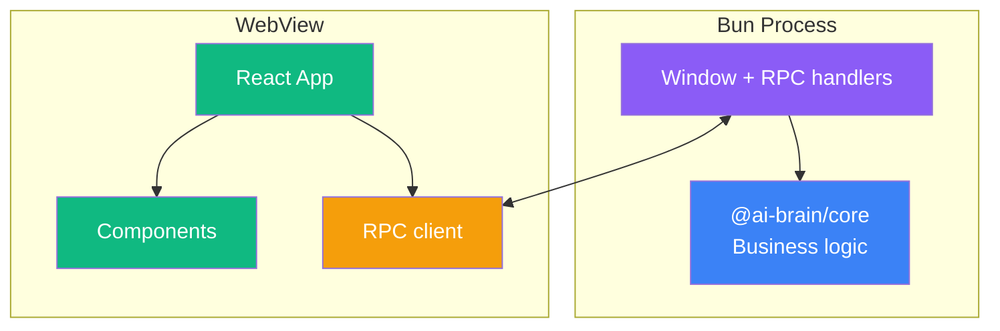

# Contributing to @ai-brain/app

## Architecture



## What This Package Does

ElectroBun desktop application for ai-brain-tool. Provides a native desktop app with setup wizard and brain dashboard using Bun process + WebView with typed RPC communication.

Window sizes: **Wizard** 600×650, **Dashboard** 1200×800.

## Development Setup

```bash
# From monorepo root
bun install
```

## Commands

```bash
# Start dev server with HMR
bun run app:dev

# Production build
bun run app:build

# Build with canary channel
bun run app:build:canary
```

## Code Style

- TypeScript strict mode
- No comments (self-documenting code)
- Follow existing patterns
- Atomic design: atoms → molecules → organisms
- All logic in `@ai-brain/core` — app only handles UI and RPC bridging
- Use `@ai-brain/ui` components — don't duplicate UI primitives
- Use `@/` path alias for internal imports

## Adding a New RPC Method

1. Add request/response types in `src/shared/rpc-types.ts`
2. Add handler in `src/bun/index.ts`
3. The client proxy in `src/mainview/lib/rpc.ts` auto-generates from types

Example:
```typescript
// src/shared/rpc-types.ts
export interface InstallGraphifyRequest {
  brainPath: string
}

export interface InstallGraphifyResponse {
  success: boolean
  version?: string
  error?: string
}

// src/bun/index.ts
{
  request: 'installGraphify',
  handler: async ({ brainPath }: InstallGraphifyRequest) => {
    return await installGraphify(brainPath)
  }
}
```

## Common Tasks

### Adding a new screen

1. Create component in `src/mainview/screens/<name>/`
2. Add route in `src/mainview/App.tsx`
3. Add RPC methods if backend communication needed

### Modifying window size

Window sizes are hardcoded in `src/bun/index.ts`:
- Wizard: 600×650
- Dashboard: 1200×800

Don't add arbitrary sizes.

### Adding core resources to build

If you reference a new core resource at runtime, add it to `electrobun.config.ts` copy rules.

## Design System

Full spec: [docs/DESIGN.md](../../docs/DESIGN.md)

Key principles:
- **Theme:** "Neural Localist" — deep navy backgrounds, purple primary, blue secondary
- **Dark mode** is the default
- **Prefer rem over px** for all sizing and spacing
- **Buttons** are `0.5rem` rounded
- **Cards** are `0.75rem` rounded

## See Also

- [Main README](README.md) - Package overview
- [AGENTS.md](AGENTS.md) - AI assistant instructions
- [Root CONTRIBUTING.md](../../CONTRIBUTING.md) - General guidelines
- [docs/DESIGN.md](../../docs/DESIGN.md) - Design specification
