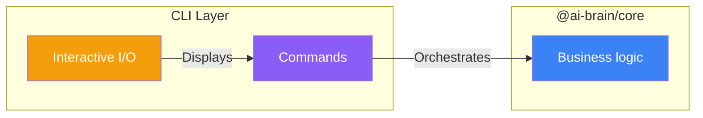

# Contributing to @jorge-moreira.dev/ai-brain-tool (CLI)

## Architecture



## What This Package Does

Interactive terminal wizard and CLI commands for brain management. Provides the `ai-brain` binary with subcommands for setup, update, status, upgrade, listing, Obsidian setup, and templates.

## Development Setup

```bash
# From monorepo root
bun install
```

## Commands

```bash
# Run all tests
bun run test:cli

# Unit tests only
bun run test:cli:unit

# Integration tests only
bun run test:cli:integration

# E2E tests (requires Docker)
bun run test:cli:e2e

# Run a single test file
bun vitest run packages/cli/tests/unit/commands/setup.test.ts
```

## Testing

- **Unit tests:** Command orchestration in `tests/unit/commands/`
- **Integration tests:** Real filesystem operations in `tests/integration/commands/`
- **E2E tests:** Docker-based with Gherkin features in `tests/e2e/`
- **Coverage:** 80%+ required

### Running E2E Tests

E2E tests require Docker:

```bash
# Local E2E (requires Docker)
bun run test:cli:e2e:local
```

## Code Style

- TypeScript strict mode
- No comments (self-documenting code)
- Follow existing patterns
- No business logic in CLI (orchestrate core functions only)
- Use `@inquirer/prompts` for interactive prompts
- Use `ora` for spinners, `chalk` for colors

## Adding a New Command

1. Create `src/commands/<name>.ts` (or `src/commands/<group>/<name>.ts` for subcommands)
2. Export a function that registers the command with Commander
3. Import and register in `src/index.ts`
4. Add unit tests in `tests/unit/commands/`
5. Add integration tests in `tests/integration/commands/`
6. For E2E, add a `.feature` file in `tests/e2e/features/`

Example command:
```typescript
import { Command } from 'commander'
import { updateBrain } from '@ai-brain/core'
import ora from 'ora'
import chalk from 'chalk'

export function registerUpdate(program: Command) {
  program
    .command('update')
    .argument('[brain-id]', 'Brain identifier')
    .option('--brain-id <id>', 'Specify brain by identifier')
    .action(async (positional, options) => {
      const brainId = positional || options.brainId
      const spinner = ora('Updating brain...').start()
      try {
        await updateBrain(brainId)
        spinner.succeed('Brain updated')
      } catch (error) {
        spinner.fail(chalk.red(error.message))
      }
    })
}
```

## Common Tasks

### Adding a new CLI option

1. Add to the command in `src/commands/<name>.ts`
2. Update tests
3. Update documentation

### Modifying build script

The build script copies resources from core:
- `requirements.txt`
- `templates/`
- `brain-skills.md`

If you add a new resource in core, update the `build` script in `package.json`.

## See Also

- [Main README](README.md) - Package overview
- [AGENTS.md](AGENTS.md) - AI assistant instructions
- [Root CONTRIBUTING.md](../../CONTRIBUTING.md) - General guidelines
