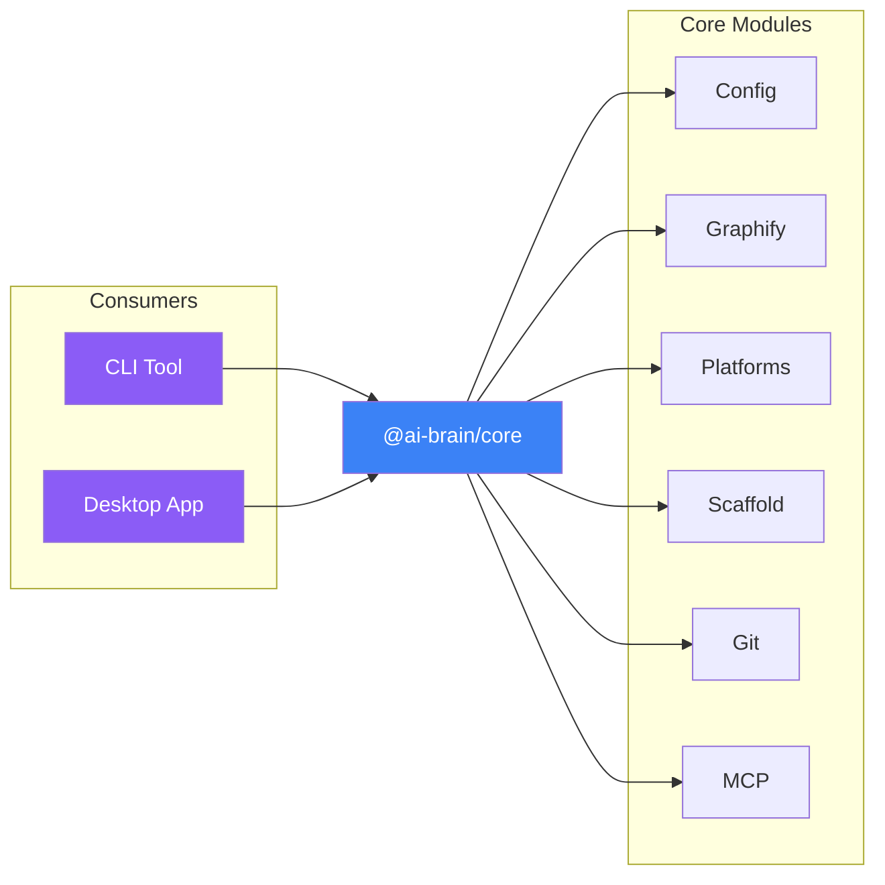

# Contributing to @ai-brain/core

## Architecture



## Development Setup

```bash
# From monorepo root
bun install
```

## Commands

```bash
# Run all tests
bun run test:core

# Unit tests only
bun run test:core:unit

# Integration tests only
bun run test:core:integration

# With coverage
bun run test:core:unit:ci
bun run test:core:integration:ci

# Run a single test file
bun vitest run packages/core/tests/unit/config/state.test.ts
```

## Testing

- **Unit tests:** Mirror `src/` structure in `tests/unit/`
- **Integration tests:** Real filesystem operations in `tests/integration/`
- **Coverage:** 85%+ required

Key test patterns:
```typescript
import { createBrainWithConfig, cleanupBrain } from '../helpers'

test('resolves brain', async () => {
  const { brainPath, configDir } = await createBrainWithConfig({ gitSync: true })
  try {
    const brain = await resolveBrain(brainPath)
    expect(brain.path).toBe(brainPath)
  } finally {
    await cleanupBrain(configDir)
  }
})
```

## Code Style

- TypeScript strict mode
- No comments (self-documenting code)
- Follow existing patterns
- Error classes live in `errors.ts`
- No UI code (pure logic only)

## Adding a New Platform

1. Create `src/platforms/<name>.ts` — use `claude.ts` as reference
2. Register in the `platforms` array in `src/platforms/index.ts`
3. Add platform-specific helpers to `shared.ts` if needed
4. Add tests in `tests/unit/platforms/` and `tests/integration/platforms/`

## Common Tasks

### Adding a new config option

1. Add to `src/config/state.ts`
2. Update `src/config/index.ts` exports
3. Add tests in `tests/unit/config/`

### Adding a new error class

1. Add to `src/errors.ts`
2. Export from `src/index.ts`
3. Add tests

## See Also

- [Main README](README.md) - Package overview
- [AGENTS.md](AGENTS.md) - AI assistant instructions
- [Root CONTRIBUTING.md](../../CONTRIBUTING.md) - General guidelines
