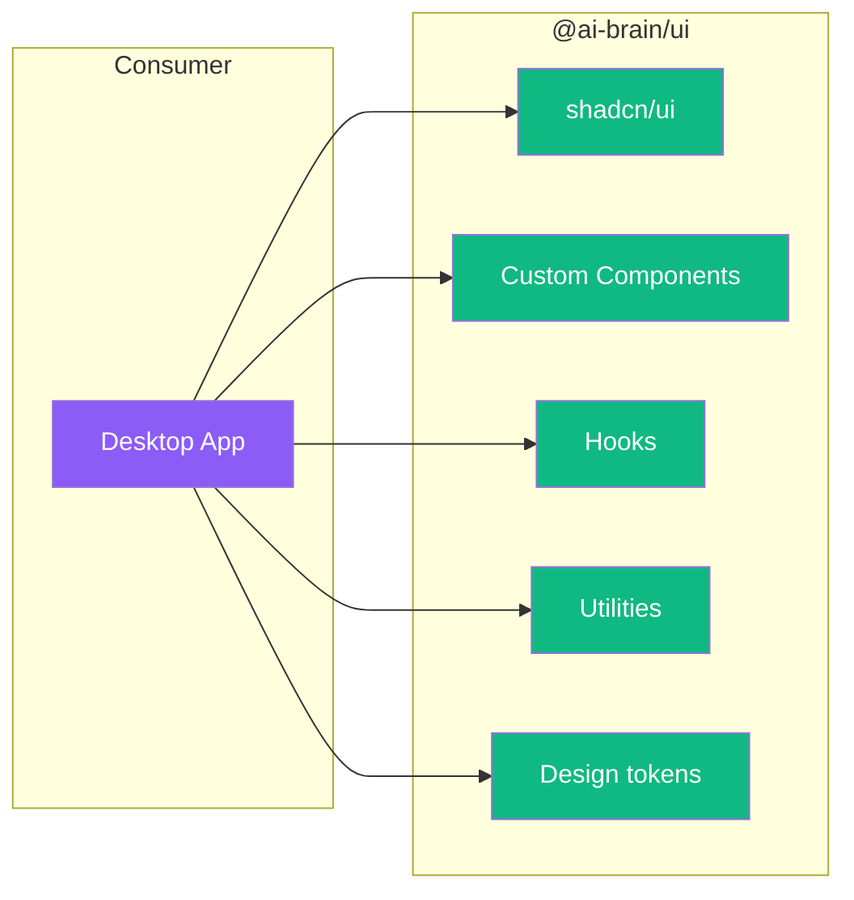

# Contributing to @ai-brain/ui

## Architecture



## What This Package Does

Reusable React component library built on Radix UI primitives + shadcn/ui patterns. Provides "Neural Localist" dark-first design system, theme management hook, `cn()` utility, and global CSS with design tokens.

## Development Setup

```bash
# From monorepo root
bun install
```

## Commands

```bash
# Start dev server (if configured)
bun run ui:dev

# Build (if configured)
bun run ui:build
```

## Code Style

- TypeScript strict mode
- No comments (self-documenting code)
- Follow existing patterns
- Always use `cn()` for conditional class merging
- No business logic — components are presentation-only
- Use CSS custom properties for colors (no hardcoded values)
- Prefer rem over px for all sizing and spacing

## Adding shadcn/ui Components

```bash
cd packages/ui
npx shadcn@latest add <component-name>
```

Components land in `src/components/ui/`. After adding, update the barrel export in `src/index.ts`.

## Design System

Full spec: [docs/DESIGN.md](../../docs/DESIGN.md)

Key principles:
- **Theme:** "Neural Localist" — deep navy backgrounds, purple primary, blue secondary
- **Dark mode** is the default; light mode via `[data-theme="light"]`
- **Design tokens** use Tailwind v4 `@theme {}` syntax in `src/styles/globals.css`
- **Buttons** are `0.5rem` rounded (Notion-inspired geometry)
- **Cards** are `0.75rem` rounded with `1px solid var(--border)`
- **Touch targets** minimum `3rem` for all interactive elements

## Common Tasks

### Adding a new component

1. Create component file in `src/components/` (custom) or `src/components/ui/` (shadcn)
2. Add to barrel export in `src/index.ts`
3. Use design tokens from `globals.css`
4. Follow atomic design: atoms → molecules → organisms

### Adding a new design token

1. Edit `src/styles/globals.css`
2. Add to `@theme {}` block
3. Use in components via CSS custom properties

Example:
```css
@theme {
  --color-primary: #8b5cf6;
  --color-secondary: #3b82f6;
}
```

### Using the cn() utility

Always use `cn()` for conditional class merging:

```typescript
import { cn } from '@ai-brain/ui'

<div className={cn('rounded-md bg-card', isActive && 'ring-2 ring-primary')} />
```

## See Also

- [Main README](README.md) - Package overview
- [AGENTS.md](AGENTS.md) - AI assistant instructions
- [Root CONTRIBUTING.md](../../CONTRIBUTING.md) - General guidelines
- [docs/DESIGN.md](../../docs/DESIGN.md) - Design specification
